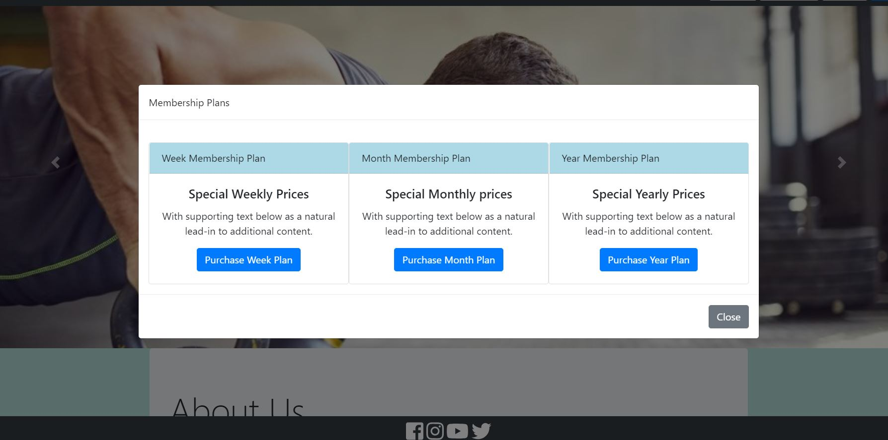
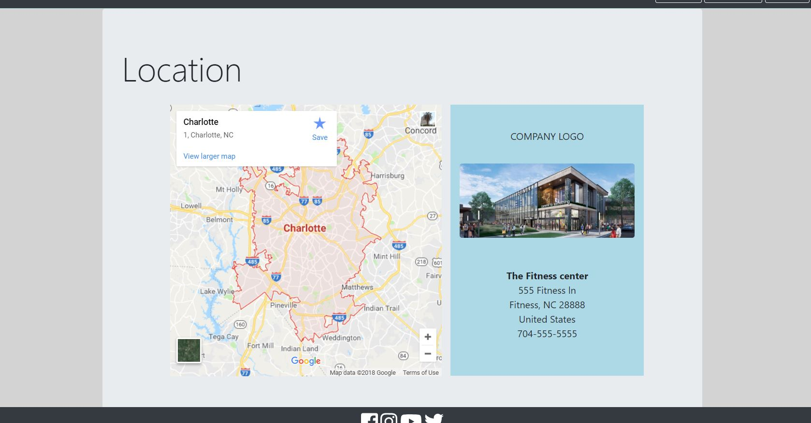
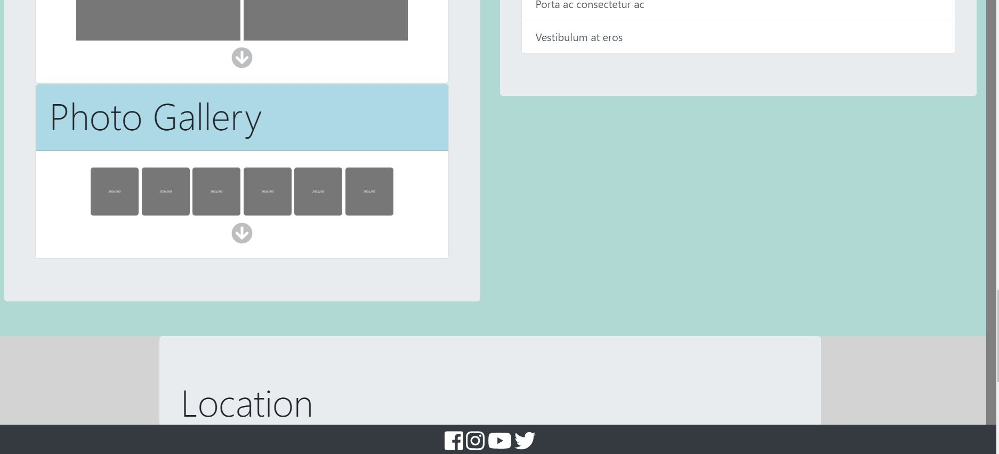
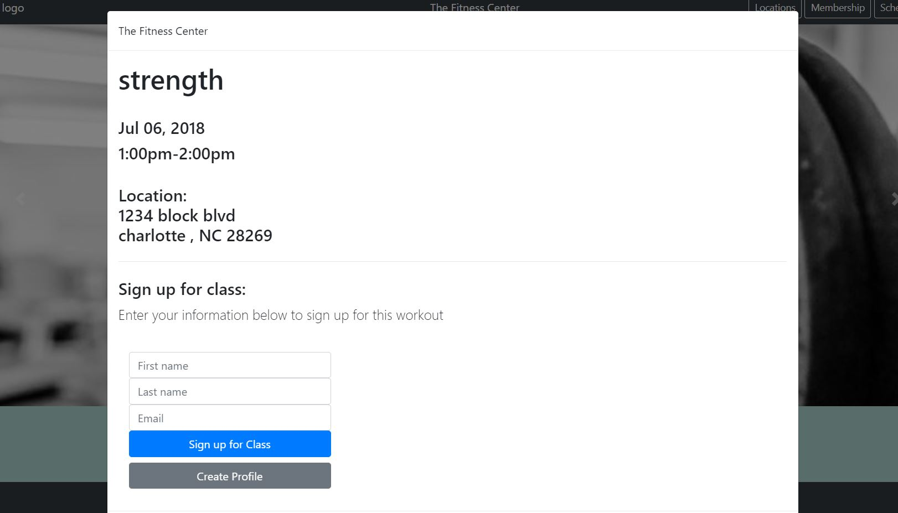

# mock-gym-site
A design showing how a fitness site could look. It has the ability to link to a separate program where information about workout plans along with days and times programs will be taken place can be updated. Those updates are then reflected on the schedule page of this site. It allows users to sign up for a specific class on specific dates and times.

## Technologies used:
- HTML5
- CSS3
- Javascript
- jQuery
- Express
- Body-Parser
- momentjs
- Bootstrap
- mySQL
- Sequelize

## Landing Page:

## About Staff and Training Options 

## Membership Plans:

## Company Location:

## Cards with Info to populate a modal:

## Photo Gallery area:

## Video Gallery area:

## View Class Schedules:

## Scroll over with mouse to sign up for class:

## Register with Gym:

## Signup sheet for workout class:

# Author:
Michael Emmons
